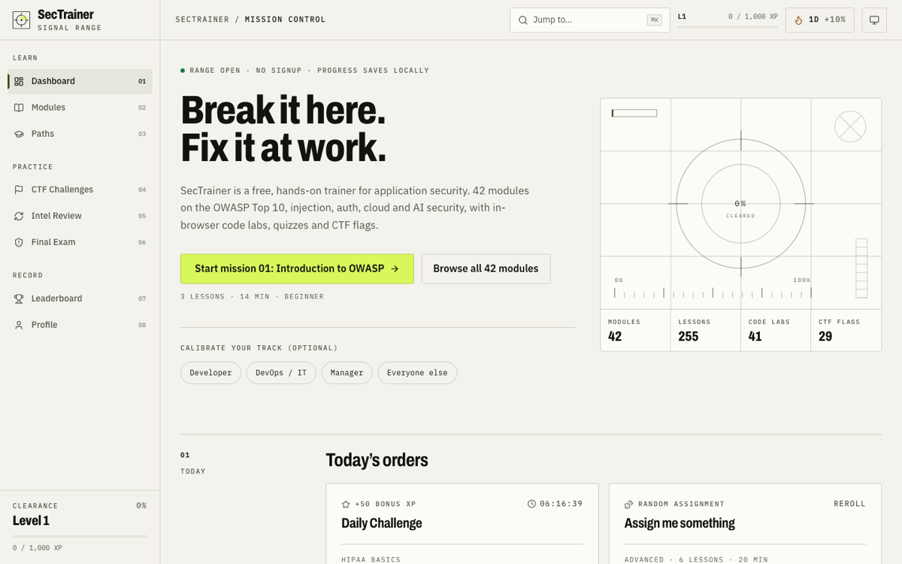
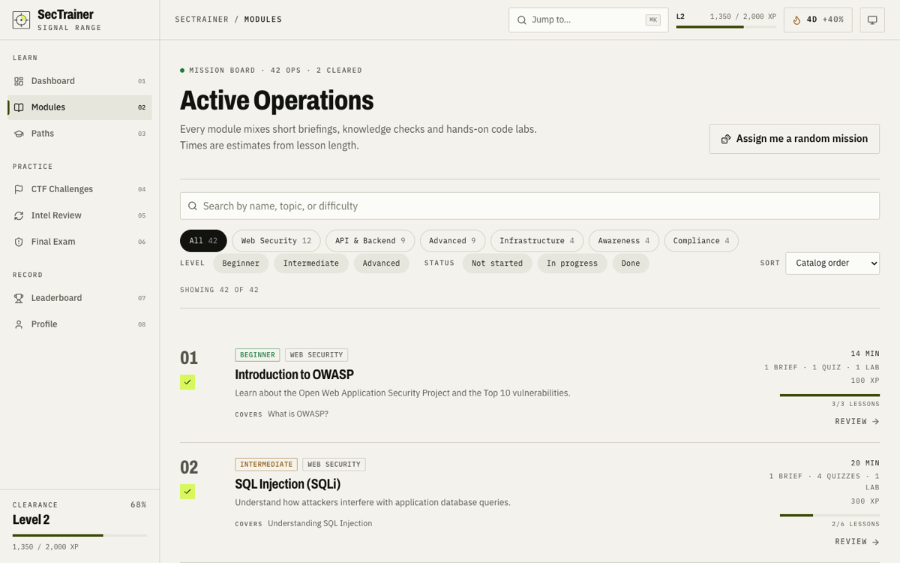
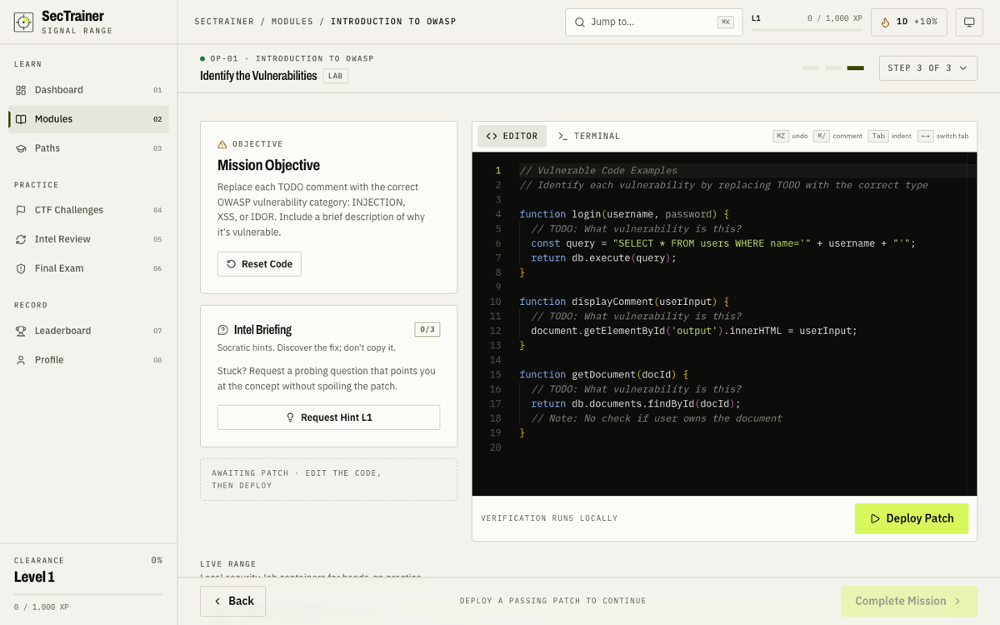
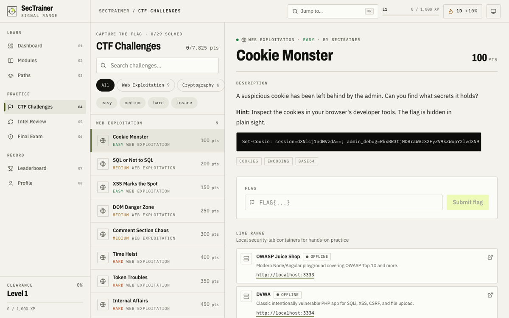
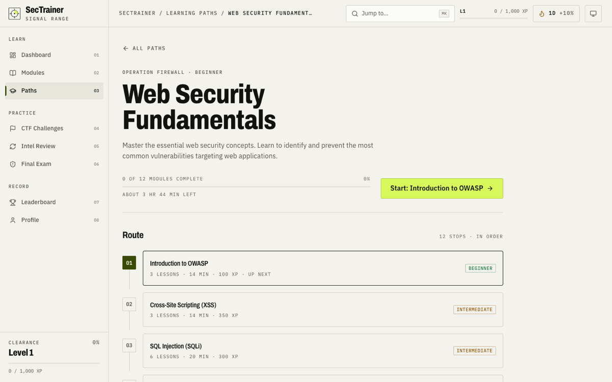

# Security Trainer

> Break it here. Fix it at work. A free, hands-on trainer for application security, with in-browser code labs, quizzes, CTF flags, and progress that saves without an account.

[](https://security-trainer.vercel.app)




## What it does

Security Trainer teaches web security by having you attack and then patch real code. It has 42 modules and 255 lessons: short briefings, knowledge checks and 41 hands-on code labs. Topics cover the OWASP Top 10, auth and session flaws, injection, cloud, container and API security, compliance basics (GDPR, HIPAA, PCI-DSS, SOC 2), phishing and social engineering, and AI security.

No signup is needed. Progress is stored in your browser, and an optional account syncs it across devices.

## Features

### Learn

- **Modules** with theory, quiz and lab lessons (`src/data/modules/`). Each module shows a time estimate and its lesson mix. 23 modules are tagged with their [OWASP Top 10:2025](https://owasp.org/Top10/2025/) category (`src/data/owaspTop10.ts`).
- **Code labs** in a Monaco editor. Patches are checked by a static verifier registry with no dynamic code execution (`src/utils/labVerification.ts`). After a passing patch, the lab shows the reference fix.
- **Socratic AI tutor**. It gives hints without handing over the answer: Groq `llama-3.1-8b-instant`, served by the rate-limited `api/socratic-hint.ts`.
- **Terminal and diagrams.** An xterm.js terminal for command-line exercises, and Mermaid diagrams of attack flows.
- **Learning paths.** Six ordered tracks, each with a route map, a resume link and a certificate.

### Practice

- **CTF board.** 29 challenges with flags, point-costing hints, and category, difficulty and hide-solved filters. Filters and the selected challenge are kept in the URL.
- **Intel Review.** A spaced-repetition review queue.
- **Final exam.** Timed, with fresh questions on each retry.
- **Local practice targets.** Juice Shop, DVWA and WebGoat run through the companion Docker lab. These links show only on localhost.

### Progress

- XP, levels, badges, daily challenges, streaks with freeze tokens, and an activity heatmap.
- A **weekly XP goal** with three tiers, measured over a rolling 7 days and compared with the week before.
- **Field ranks** from Recruit to Director, earned through completed modules and certified paths.
- A leaderboard, available when Supabase is configured.

### Usability

- **Command palette.** Open it with `Cmd/Ctrl+K` or `/` to search pages, modules (including OWASP IDs), paths and challenges.
- Catalog filters kept in the URL, a resume panel, and a random-mission button.
- Light and dark themes that follow the system setting, plus reduced-motion support.
- Accessibility checked with automated tools: Lighthouse accessibility scores 0.97, and the ESLint and Biome a11y rules pass. No manual WCAG audit has been done yet.
- PWA service worker. Fonts are self-hosted, so the first page makes no third-party requests.

| Catalog                                                   | Code lab                                                 |
| --------------------------------------------------------- | -------------------------------------------------------- |
|    |    |
| **CTF board**                                             | **Learning path**                                        |
|  |  |

## Getting started

```bash
git clone https://github.com/forbiddenlink/security-trainer
cd security-trainer
pnpm install
pnpm dev
```

The app runs with no configuration. To turn on optional services, copy `.env.example` to `.env.local` and fill in what you need:

| Variable                                                             | Enables                                                                                         |
| -------------------------------------------------------------------- | ----------------------------------------------------------------------------------------------- |
| `VITE_SUPABASE_URL`, `VITE_SUPABASE_ANON_KEY`                        | Accounts, cloud sync and the leaderboard                                                        |
| `VITE_AUTH_GITHUB`                                                   | The GitHub sign-in button. Set it to `true` only after you enable the provider in Supabase Auth |
| `VITE_POSTHOG_KEY`, `VITE_POSTHOG_HOST`                              | Analytics. Loaded lazily, and skipped when the browser sends Do-Not-Track or GPC                |
| `GROQ_API_KEY`, `UPSTASH_REDIS_REST_URL`, `UPSTASH_REDIS_REST_TOKEN` | The AI tutor endpoint and its rate limiter (server side)                                        |
| `AI_DISABLED`, `AI_DAILY_BUDGET`                                     | Tutor kill switch (`AI_DISABLED=1`) and daily request budget                                    |

### Scripts

```bash
pnpm dev              # Vite dev server
pnpm build            # Type-check and production build
pnpm preview          # Serve the production build
pnpm lint             # ESLint
pnpm biome:check      # Biome lint (formatting is Prettier's job)
pnpm test             # Vitest, watch mode
pnpm test:run         # Vitest, single run
pnpm test:coverage    # Vitest with coverage
pnpm test:e2e         # Playwright end-to-end tests
```

## Adding content

- **Module:** add a file to `src/data/modules/`, then export it from `index.ts`. If the module has a lab, register a verifier in `src/utils/labVerification.ts` keyed by the lab ID.
- **OWASP tag:** add the module to `src/data/owaspTop10.ts`, but only when its core CWE is listed on that category's owasp.org page.
- **CTF challenge:** add it to `src/data/ctfChallenges.ts`, storing the flag as a `hashFlagSync` digest.

Lesson and CTF content deliberately contains fake credentials as teaching material. `.gitleaks.toml` allowlists `src/data/**`.

## Tech stack

- **Framework:** Vite 8, React 19, React Router 7, TypeScript
- **Styling:** Tailwind CSS 4 with the "Signal Range" design system (tokens in `src/index.css`)
- **State:** Zustand, persisted to localStorage
- **Lessons:** Monaco Editor, xterm.js, Mermaid, Framer Motion
- **Backend:** Supabase (optional), a Vercel serverless function for the AI tutor, and Upstash rate limiting
- **Testing:** Vitest with Testing Library, and Playwright
- **Quality:** ESLint, Biome lint, Prettier through lint-staged, and gitleaks

Design research, the redesign plan and before/after screenshots are in [`design-research/`](design-research/report.md).
