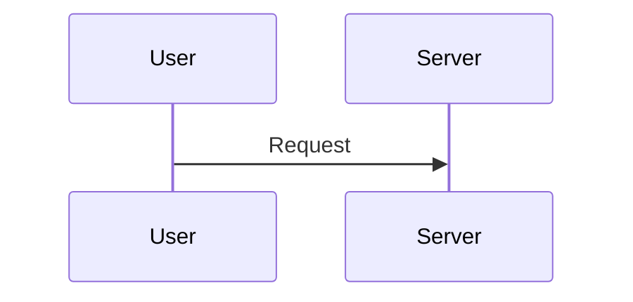

# Handoff: Security Trainer Audit & Content Improvements

## Task(s)

**All tasks COMPLETED:**

1. **Project Audit** - Ran comprehensive code review using feature-dev:code-reviewer and Explore agents
2. **Bug Fixes** - Fixed 3 critical memory leak/race condition issues
3. **Missing Feature** - Added /reviews page (was broken link in IntelRefresher)
4. **Accessibility** - Added aria-hidden and aria-label to decorative elements
5. **Content Improvements** - Added Mermaid diagrams and YouTube video embeds to 5 key lessons

## Critical References

- `thoughts/ledgers/CONTINUITY_CLAUDE-security-trainer-improvements.md` - Full project state and history
- `src/components/lesson/TheoryView.tsx` - Enhanced markdown renderer with diagram/video support

## Recent changes

- `src/store/gameStore.ts:573-580` - Clear syncTimeout on resetProgress()
- `src/store/authStore.ts:55-58,367-373` - Added cleanup() function for auth subscription
- `src/components/Header.tsx:40-51` - Fixed race condition by chaining auth init
- `src/pages/Reviews.tsx` - NEW: Full reviews page for spaced repetition
- `src/App.tsx:29-31,75` - Added Reviews route
- `src/components/lesson/MermaidDiagram.tsx` - NEW: Lazy-loaded diagram component
- `src/components/lesson/VideoEmbed.tsx` - NEW: YouTube privacy-mode embed
- `src/components/lesson/TheoryView.tsx` - Enhanced with mermaid and video support
- `src/data/modules/owasp-intro.ts` - Added mind map + video
- `src/data/modules/xss-basics.ts` - Added sequence diagram + video
- `src/data/modules/sql-injection.ts` - Added flowchart + video
- `src/data/modules/csrf-attacks.ts` - Added sequence diagram + video
- `src/data/modules/broken-auth.ts` - Added attack/defense diagram
- `vite.config.ts:51-63` - Mermaid bundle optimization (separate 2.1MB chunk)

## Learnings

1. **Mermaid is large** - 2.1MB bundle. Must lazy-load via dynamic import() and separate chunk to avoid bloating initial load. See `MermaidDiagram.tsx` for pattern.

2. **Video embed syntax** - Created custom shortcode `::video[url]{title="..." caption="..."}` processed in TheoryView before markdown parsing.

3. **Module-level state in Zustand** - Variables like `syncTimeout` outside the store need manual cleanup in reset functions. Easy to miss.

4. **Race conditions with auth** - `checkStreak()` and `checkDailyChallenge()` were running before `initialize()` completed. Fix: chain them in single async effect.

## Post-Mortem

### What Worked

- Using feature-dev:code-reviewer agent found real memory leak bugs that manual review might miss
- Lazy loading mermaid via dynamic import() kept main bundle reasonable
- YouTube privacy mode (youtube-nocookie.com) + click-to-play respects user privacy

### What Failed

- Initial vite chunking for mermaid caused circular dependency warning - had to include more dependencies (d3, dagre, lodash-es, etc.)
- First attempt at mermaid component didn't lazy load - had to move `import mermaid` into useEffect

### Key Decisions

- Decision: Use custom `::video[url]{...}` shortcode instead of raw HTML
  - Alternatives: Direct iframe in markdown, custom React component syntax
  - Reason: Cleaner lesson content, processed before markdown parsing

- Decision: Click-to-play for videos instead of auto-embed
  - Alternatives: Immediate iframe load
  - Reason: Privacy (no tracking until click), performance (no iframe load until needed)

## Artifacts

- `thoughts/ledgers/CONTINUITY_CLAUDE-security-trainer-improvements.md` - Updated ledger
- `src/pages/Reviews.tsx` - New reviews page
- `src/components/lesson/MermaidDiagram.tsx` - Diagram component
- `src/components/lesson/VideoEmbed.tsx` - Video embed component

## Action Items & Next Steps

**Project is feature-complete.** All checklist items done:

- 28 training modules
- 341 tests passing
- PWA/offline support
- Diagrams & videos in lessons
- Spaced repetition + learning paths
- Dark mode + accessibility

**Optional future work:**

- Add more modules (GraphQL security, WebSockets, OAuth)
- Analytics for tracking user progress
- Community features (comments, discussions)
- Team/enterprise features

## Other Notes

**Test commands:**

```bash
npm run test -- --run  # 341 tests
npm run build          # Production build
npm run lint           # ESLint
npm run dev            # Dev server at localhost:5173
```

**Bundle sizes (optimized):**

- Vendor: 1.2MB (main dependencies)
- Mermaid: 2.1MB (lazy loaded only when viewing diagrams)
- Lesson content: 220KB (all 28 modules)

**Video/diagram syntax in lessons:**

````markdown
::video[https://youtube.com/watch?v=xxx]{title="Title" caption="Caption"}


````

```

```
